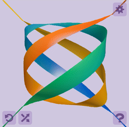

# Twist 'em up! Turn 'em 'round!

In memory of [John Horton Conway](https://en.wikipedia.org/wiki/John_Horton_Conway)
(1937&ndash;2020), dwelling in particular on the
[Canada/USA Mathcamp](https://www.mathcamp.org/)
performance that this game is an adaptation of&mdash;during which
he wrapped the tangle in paper that he later tore open
with his teeth.

* [Link to live demo](http://pteromys.melonisland.net/twistemup/)

## Sample animation

## Further reading

* [Video of a class doing it with real string that's under no obligation to stay on a dumpling surface.](https://www.youtube.com/watch?v=URg-t3HZE5M)
* [Tom Davis's instructions for doing it in your own class with real string.](http://www.geometer.org/mathcircles/tangle.pdf)
* [Goldman and Kauffman give a proof of Conway's theorem.](http://homepages.math.uic.edu/~kauffman/RTang.pdf)
* [More sources gathered by u/gmsc.](https://www.reddit.com/r/math/comments/2gvesa/john_conways_rational_tangles/)

## Licenses

* This project itself is released under the [Unlicense](http://unlicense.org/).
* [jQuery](https://jquery.org/license/) and
  [HammerJS](https://github.com/hammerjs/hammer.js/blob/master/LICENSE.md)
  are used under the
  [MIT License](https://opensource.org/licenses/MIT).
* [nutkit-umbra](https://github.com/pteromys/nutkit-umbra) and
  [nutkit-anima](https://github.com/pteromys/nutkit-anima)
  are used under the
  [Apache License, Version 2.0](http://opensource.org/licenses/Apache-2.0).
